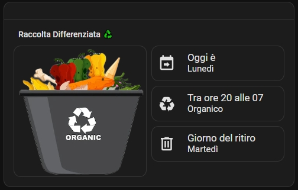
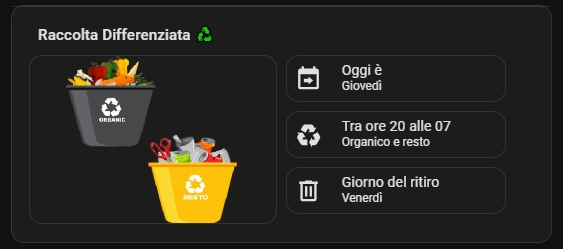

<h2><strong>♻️ Garbage card for home assistant</strong></h2>

Volevo condividere una card che ho creato tempo fa, per mostrare i giorni di raccolta dei rifiuti, qualcuno aveva aggiunto dei pezzi alla mia originale e allora ho ripreso il tutto e aggiunto altre cose, 

Istruzioni:

<ol dir="auto">
<li>da Hacs, installa: a. hui-element b. button-card</li>
<li>crea una nuova card in HA incollando il contenuto del file: garbage_card.txt</li>
<li>nella cartella packeges incolla il file: differenziata.yaml e sensor_time_e_date.yaml</li>
<li>apri il file differenziata.yaml modifica SOLO le prime righe dalla 23 alla 25 e alla riga 196 inserisci 1 o 2 o tutti gli alexa che interessano
<li>nella cartella www, crea una cartella con le immagini dei rifiuti all'interno</li>
<li>verifica nella card che tra la riga 27 e 33 i percorsi delle immagini che stai usando sia corretti</li>
<li>ora la card funziona, ti resta che clicka sull'immagine del riufiuto per configurarla</li>
<li>il plus che ho modificato è che puoi impostare un volume per la notifica di alexa e poi riportare il volume della notifa basso (per me fondamentale), il ritardo deve essere maggiore di 12 se il messaggio riprodotto è più lungo </li>
</ol>

A chi interessa avere la card con per la raccolta bisettimanale, la trovate al seguente link, ma non avrà le nuove modifiche che ho apportato:
https://github.com/scheccia1/hagarbage

Buon divertimento!

----------------------------------------

Would you like to give me a hand? The content of this page is completely free of charge and the purpose is certainly not to make money. If you would like to lend me a hand to help with expenses and lost time, you have the following ways:

Make your Amazon purchases from this link:

Join our Telegram channel dedicated to Home Assistant news:

Join our Telegram channel dedicated to home automation products, there are lots of offers:

