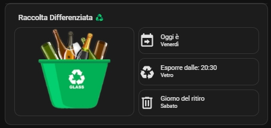

<h2><strong>♻️ Garbage card for home assistant</strong></h2>

I wanted to share a card I created to display garbage collection days

Instructions:

<ol dir="auto">
<li>from Hacs, install: a. hui-element b. button-card</li>
<li>create a new card in HA by pasting the contents of the file: garbage_card.txt</li>
<li>in the HA file sensor.yaml, insert the contents of garbage_sensor.txt, if you do not have the file: a. you must create sensor.yaml in the config/ folder b. open the file configuration.yaml and insert this line: sensor: !include sensor.yaml</li>
<li>in the www folder, create a folder with the garbage images inside</li>
<li>modify the various entities with your personal ones</li>
</ol>

Enjoy!

----------------------------------------

Ti va di darmi una mano? Il contenuto di questa pagina &egrave; completamente gratuito il fine non &egrave; certo guadagnare. Se ti va di darmi una mano per sostenere le spese e il tempo perso, hai le seguenti modalit&agrave;:

&nbsp;

 Effettua i tuoi acquisti Amazon a partire da <a href="https://amzn.to/3XWWTgz" target="_blank">QUESTO LINK</a>  Entra nel nostro canale Telegram dedicato alle news su Home Assistant: <a title="Home Assistant News" href="https://t.me/Home_Assistant_News" target="_blank">Home Assistant News</a>  Entra nel nostro canale Telegram dedicato ai prodotti per la domotica, ci sono moltissime offerte: <a title="offerte_domotica" href="https://t.me/offerte_domotica_ita" target="_blank">Offerte_domotica</a>

